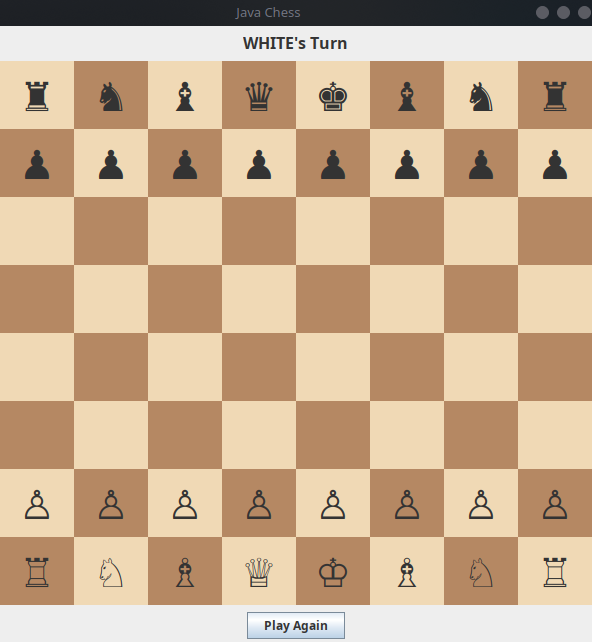

♟️ Chess Bot (Java Swing)

A complete desktop Chess game built using Java Swing, featuring a graphical user interface and an AI opponent powered by the Minimax algorithm with Alpha-Beta pruning.

This project is implemented in a single Java file and runs on any system with Java installed.

🚀 Features

✅ Fully functional chess board (8x8 GUI)

✅ Legal move validation for all pieces

✅ Castling support

✅ En Passant support

✅ Pawn promotion

✅ Check & Checkmate detection

✅ Stalemate detection

✅ AI opponent (Black) using Minimax with Alpha-Beta pruning

✅ Responsive UI using SwingWorker

✅ Cross-platform (Windows, Linux, macOS)

🛠️ Tech Stack

- Java (JDK 17+ recommended)

- Java Swing (built-in)

- AWT

- No external dependencies

📦 Requirements

- Java JDK 8 or higher
 (JDK 17+ recommended)

- Check your Java version:

```bash
java -version
```

## ▶️ How To Run

### 1️⃣ Clone the repository

```bash
git clone https://github.com/your-username/Chess_Bot.git
cd Chess_Bot
```

### 2️⃣ Compile

```bash
javac ChessGame.java
```

### 3️⃣ Run

```bash
java ChessGame
```


The game window will open automatically.

🧠 AI Details

- The AI uses:

- Minimax algorithm

- Alpha-Beta pruning

- Material-based board evaluation

- Configurable search depth

- Default depth: 3

## 🖼️ Screenshot

<p align="center">
  
</p>

🎯 Future Improvements

- Adjustable AI difficulty

- Move history panel

- Undo / Redo

- Sound effects

- Opening book support

- FEN/PGN support

📜 License

This project is open-source and free to use for educational purposes.

👨‍💻 Author

Sukanta Dutta
Aspiring Full Stack & Software Developer